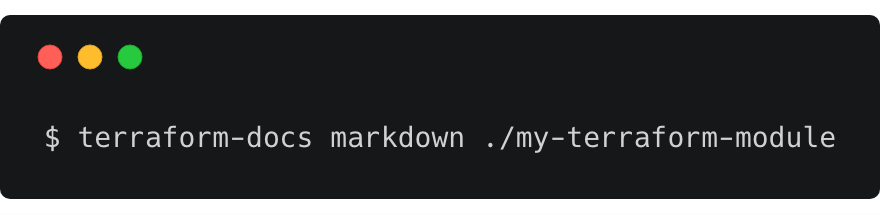

# terraform-docs

#### Terraform Docs is a utility to generate documentation from Terraform modules in various output formats.

**Official Project repo:** https://github.com/segmentio/terraform-docs


<div align="left">
    
</div>

## Docker Usage

Build the docker image using provided Dockerfile and use it directly for example:

```bash
docker run --rm -v "$(pwd)":/data -t binbash/terraform-docs markdown table /data
```
