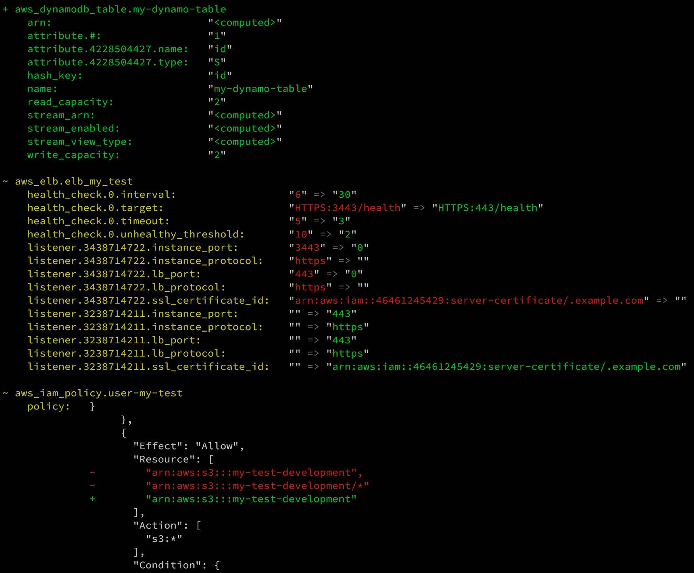

# terraform-landscape

#### Terraform Landscape is a tool for reformatting the output of `terraform plan` to be easier to read and understand.

#### Before
<div align="left">
    
</div>

#### After
<div align="left">
    
</div>

## Docker Usage

Build the docker image using provided Dockerfile and use it directly:

```bash
terraform plan ... | docker run -i --rm binbash/terraform-landscape
```